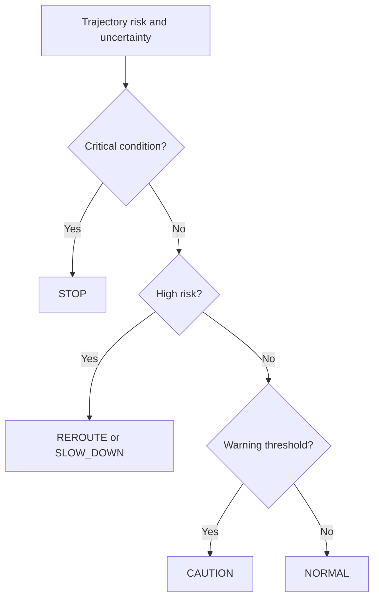

# Uncertainty-Aware Navigation

<p align="center">
  <strong>Risk-, uncertainty-, and recoverability-aware planning for autonomous mobile robots</strong><br/>
  A reproducible synthetic research framework for studying safe navigation under incomplete maps and uncertain perception.
</p>

<p align="center">
  <a href="https://github.com/panagiotagrosdouli/uncertainty-aware-navigation/actions/workflows/ci.yml"></a>
  
  
  
</p>

> **Research question**  
> How should an autonomous robot trade path efficiency against uncertainty, environmental risk, and the ability to recover from future failures?

## Research vision

Shortest-path planning assumes that the map and traversal costs are sufficiently reliable. In unknown or partially observed environments, this assumption can produce brittle behavior: a short route may cross uncertain cells, narrow passages, poorly observed regions, or states from which safe recovery is difficult.

This repository studies navigation as a multi-objective decision problem. It combines occupancy belief, normalized uncertainty, spatial risk, recoverability, and a runtime safety supervisor in one deterministic synthetic benchmark.

<p align="center">
  
</p>

## Research contributions

| Contribution | Description |
|---|---|
| Belief-aware mapping | Occupancy belief and uncertainty fields represent incomplete environmental knowledge. |
| Risk-field construction | Obstacle proximity, unknown space, narrow passages, and uncertainty contribute to traversal risk. |
| Planner comparison | Dijkstra, A*, uncertainty-aware A*, risk-aware A*, and recoverability-aware variants share a common benchmark. |
| Runtime supervision | Explicit NORMAL, CAUTION, REROUTE, SLOW_DOWN, and STOP states expose mission-level safety decisions. |
| Reproducible artifacts | Metrics, maps, figures, reports, GIF, and MP4 outputs are generated entirely from code. |

## System architecture


## Planning formulation

For a candidate path `π`, the prototype evaluates

```math
J(\pi) = \sum_{c \in \pi}
\left[
1 + \lambda_u U(c) + \lambda_r R(c) - \lambda_{rec}\Gamma(c)
\right],
```

where:

- `U(c)` is map or perception uncertainty;
- `R(c)` is the estimated traversal risk;
- `Γ(c)` is recoverability or escape capacity;
- the `λ` coefficients determine mission preferences.

This formulation makes the trade-off between efficiency and safety explicit and inspectable.

## Implemented, prototype, and planned

| Component | Status | Notes |
|---|---:|---|
| Deterministic 2-D grid-world simulator | Implemented | blocked-corridor and narrow-passage scenario |
| Occupancy belief and uncertainty maps | Implemented | entropy and unknown/frontier uncertainty |
| Composite risk map | Implemented | obstacle, unknown-space, uncertainty, and passage risk |
| Dijkstra and A* baselines | Implemented | shared planner core |
| Uncertainty- and risk-aware A* | Implemented | configurable objective terms |
| Recoverability-aware planning | Prototype | clearance/risk-based scaffold |
| Runtime safety supervisor | Implemented | five explicit safety modes |
| Metrics, figures, reports, GIF, MP4 | Implemented | generated and labeled Synthetic Demo |
| ROS 2 / Nav2 integration | Planned | not included |
| Real-robot validation | Planned | not claimed |

## Installation

```bash
git clone https://github.com/panagiotagrosdouli/uncertainty-aware-navigation.git
cd uncertainty-aware-navigation
python -m venv .venv
source .venv/bin/activate
python -m pip install -e '.[dev]'
```

## Reproduce the Synthetic Demo

```bash
python scripts/run_all.py
pytest
```

Individual stages can also be executed separately:

```bash
python scripts/run_synthetic_demo.py
python scripts/generate_figures.py
python scripts/make_demo_gif.py
python scripts/run_benchmarks.py
```

## Generated research artifacts

```text
results/metrics/summary.json
results/metrics/metrics.csv
results/metrics/safety_events.csv
results/metrics/occupancy_grid.npy
results/metrics/belief_map.npy
results/metrics/uncertainty_map.npy
results/metrics/risk_map.npy
results/metrics/recoverability_map.npy
results/figures/*.png
results/reports/benchmark_report.md
assets/gifs/demo.gif
assets/videos/demo.mp4
```

All outputs are labeled **Synthetic Demo**. They validate software behavior and reproducibility, not real-world robotic safety.

## Evaluation dimensions

The framework is intended to compare planners across:

- mission success and collision proxies;
- path length and planning effort;
- uncertainty and risk exposure;
- obstacle clearance and narrow-passage use;
- terminal recoverability;
- reroute, slowdown, and stop events;
- sensitivity to objective weights.

## Safety supervisor



The supervisor is an interpretable policy layer. It is not a formally verified safety controller.

## Limitations

- The environment is a deterministic synthetic grid world.
- Dynamic obstacle and recoverability models are simplified.
- Risk scores are engineering diagnostics, not calibrated probabilities.
- The repository does not provide ROS 2 integration, continuous dynamics, formal guarantees, or hardware validation.
- No state-of-the-art or deployment-readiness claim is made.

## Research roadmap

1. Multi-seed randomized map and degradation suites.
2. Calibration of uncertainty and risk against observed failures.
3. Dynamic-obstacle prediction and temporal risk fields.
4. Belief-space and recoverability-aware model predictive control.
5. ROS 2/Nav2 integration with simulator and rosbag evaluation.
6. Closed-loop physical-robot experiments with traceable safety events.

## MSc / PhD directions

- uncertainty calibration for navigation costs;
- active perception driven by route uncertainty;
- recoverability-aware planning and control;
- conformal or distribution-free risk bounds;
- safe policy switching under localization degradation;
- joint SLAM–planning uncertainty propagation.

## Citation

Use [`CITATION.cff`](CITATION.cff) to cite this repository as research software until a validated manuscript is available.

## License

Released under the MIT License.