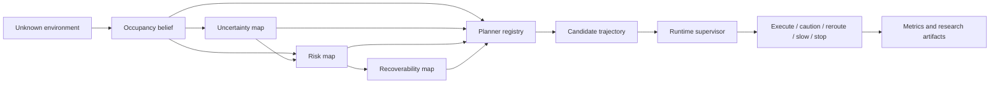
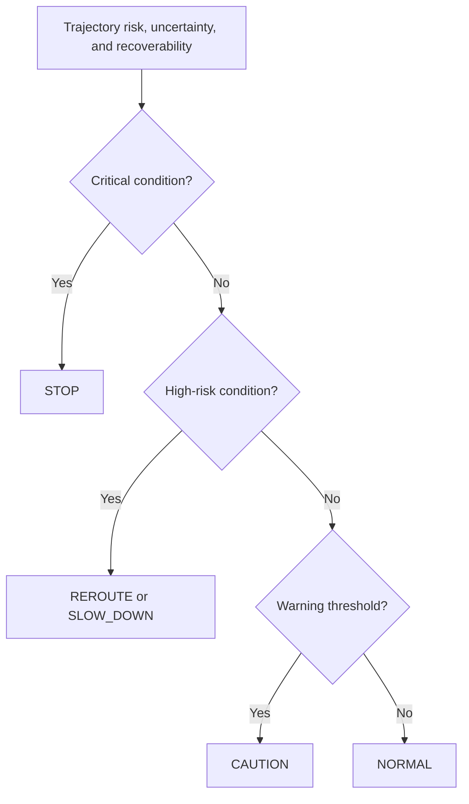

<div align="center">

# Uncertainty-Aware Navigation

## Risk-, Uncertainty-, and Recoverability-Aware Planning for Autonomous Mobile Robots

A reproducible Python research prototype for studying navigation decisions under incomplete maps, uncertain perception, spatial risk, and limited recovery capacity.

[](https://github.com/panagiotagrosdouli/uncertainty-aware-navigation/actions/workflows/ci.yml)
[](pyproject.toml)
[](LICENSE)
[](#verified-scope)

**English** · [Ελληνικά](README_GR.md)

</div>

<p align="center">
  
</p>

<p align="center"><em>Conceptual overview of the repository. The figure explains the implemented research pipeline; it is not experimental evidence, a formal safety proof, or a deployment certification.</em></p>

## Abstract

Autonomous navigation in unknown or partially observed environments cannot be reduced to geometric shortest-path planning. A route may be short yet traverse poorly observed cells, high-risk regions, narrow passages, or states from which recovery becomes difficult. This repository studies navigation as an auditable multi-objective decision problem in which occupancy belief, normalized uncertainty, spatial risk, recoverability, and runtime supervision are represented explicitly.

The software provides a deterministic synthetic benchmark that compares classical graph-search baselines with uncertainty-, risk-, and recoverability-aware planning variants. Candidate trajectories are evaluated not only by path length, but also by uncertainty exposure, risk accumulation, clearance, and retained recovery capacity. A finite-state safety supervisor then maps trajectory diagnostics to interpretable runtime actions such as normal execution, caution, rerouting, slowdown, or stop.

The project is designed as research software rather than as a production robot stack. Its main contribution is a transparent experimental platform for investigating how navigation behavior changes when safety-relevant quantities are included directly in the planning objective and mission logic. Generated maps, metrics, figures, reports, GIFs, and videos support reproducibility and qualitative inspection. The current evidence is synthetic; ROS 2, Nav2, continuous dynamics, hardware experiments, calibrated failure probabilities, and formal end-to-end guarantees remain outside the validated scope.

---

## Research question

> **How should an autonomous robot trade path efficiency against uncertainty, environmental risk, and the ability to recover from future failures?**

The repository decomposes this question into four testable subproblems:

1. **Representation:** How should incomplete environmental knowledge be represented as occupancy belief and uncertainty fields?
2. **Planning:** How should uncertainty, risk, and recoverability modify path selection?
3. **Supervision:** How should trajectory diagnostics trigger caution, rerouting, slowdown, or stopping?
4. **Evaluation:** Which metrics reveal the trade-off between geometric efficiency and safety-oriented behavior?

---

## Research motivation

Classical Dijkstra and A* search assume that traversal costs are sufficiently known and stable. In a partially observed environment, that assumption may produce brittle behavior:

- unknown cells may be treated as harmless or uniformly traversable;
- perception uncertainty may not influence route selection;
- narrow passages may appear efficient despite poor clearance;
- a candidate path may reduce the robot's future escape options;
- a planner may continue nominal execution even when route diagnostics become unacceptable.

This repository makes those failure modes explicit. It does not claim that one scalar risk score solves robot safety. Instead, it provides a controlled environment in which these quantities can be logged, compared, ablated, and discussed separately.

---

## What was implemented

The repository contains an end-to-end synthetic workflow:

```text
unknown or partially observed grid
        ↓
occupancy belief and uncertainty estimation
        ↓
composite spatial risk construction
        ↓
recoverability / escape-capacity estimation
        ↓
planner registry and candidate path generation
        ↓
trajectory-level metrics and comparison
        ↓
runtime safety supervisor
        ↓
normal / caution / reroute / slow down / stop
        ↓
metrics, figures, reports, GIF, and MP4 artifacts
```

### Core contributions

| Research component | Implemented role |
|---|---|
| **Belief-aware mapping** | Represents incomplete knowledge using occupancy belief, entropy, unknown-space, and frontier-related uncertainty. |
| **Composite risk fields** | Combines obstacle proximity, unknown space, uncertainty, and narrow-passage structure into an inspectable traversal signal. |
| **Comparable planner variants** | Evaluates Dijkstra, A*, uncertainty-aware A*, risk-aware A*, and recoverability-aware variants through a shared workflow. |
| **Recoverability reasoning** | Estimates whether a state preserves clearance, escape capacity, and future recovery options. |
| **Runtime supervision** | Converts route diagnostics into explicit mission modes: `NORMAL`, `CAUTION`, `REROUTE`, `SLOW_DOWN`, and `STOP`. |
| **Reproducible research artifacts** | Generates numerical metrics, NumPy maps, figures, Markdown reports, GIFs, and MP4 files entirely from code. |

---

## System architecture



The architecture separates three responsibilities:

- **world representation**, which estimates what is known and how uncertain it is;
- **decision generation**, which computes and scores candidate trajectories;
- **mission supervision**, which interprets trajectory diagnostics at runtime.

---

## Mathematical formulation

For a candidate path \(\pi\), the synthetic prototype evaluates a configurable cost of the form

```math
J(\pi)=\sum_{c\in\pi}
\left[
1+\lambda_u U(c)+\lambda_r R(c)-\lambda_{rec}\Gamma(c)
\right],
```

where:

- \(U(c)\) is uncertainty at cell \(c\);
- \(R(c)\) is estimated traversal risk;
- \(\Gamma(c)\) is recoverability or escape capacity;
- \(\lambda_u\), \(\lambda_r\), and \(\lambda_{rec}\) define mission preferences.

The path-selection problem is therefore

```math
\pi^*=\arg\min_{\pi\in\Pi(s,g)}J(\pi),
```

subject to occupancy and connectivity constraints in the grid graph.

This objective is intentionally interpretable. It exposes the trade-off among path efficiency, uncertainty avoidance, risk avoidance, and retained recovery capacity. The terms are engineering research signals; they are not automatically calibrated probabilities or formal safety certificates.

---

## Planner families

| Planner family | Primary objective | Research role |
|---|---|---|
| Dijkstra | accumulated traversal cost | uninformed optimal baseline on the represented graph |
| Classical A* | path cost plus geometric heuristic | informed geometric baseline |
| Uncertainty-aware A* | geometric cost plus uncertainty exposure | tests whether uncertain regions alter route selection |
| Risk-aware A* | geometric cost plus composite risk | tests safety-efficiency trade-offs |
| Recoverability-aware planning | cost and risk adjusted by recovery capacity | tests whether future escape options influence planning |

All planners should be compared on identical scenarios, starts, goals, and map representations. A lower risk score is not meaningful unless path length, success, clearance, and supervision events are reported alongside it.

---

## Runtime safety supervisor



The supervisor is an interpretable policy layer that makes runtime decisions visible in logs and generated artifacts. It is **not** a formally verified controller, certified emergency system, or substitute for hardware-level safety mechanisms.

---

## Synthetic robot demonstration

<p align="center">
  
</p>

<p align="center"><em>Generated synthetic demonstration. It visualizes software behavior in the configured grid-world scenario and must not be interpreted as physical-robot validation.</em></p>

The repository can also generate a dedicated robot showcase, GIF, and MP4 through the media workflow.

---

## Verified scope

| Component | Status | Evidence boundary |
|---|---:|---|
| Deterministic 2-D grid-world environment | Implemented | synthetic scenarios and automated tests |
| Occupancy belief and uncertainty maps | Implemented | entropy and unknown/frontier diagnostics |
| Composite spatial risk map | Implemented | obstacle, uncertainty, unknown-space, and passage terms |
| Dijkstra and A* baselines | Implemented | shared graph-search workflow |
| Uncertainty- and risk-aware A* | Implemented | configurable synthetic evaluation |
| Recoverability-aware planning | Research prototype | clearance- and risk-derived scaffold |
| Five-mode runtime supervisor | Implemented | logged synthetic state transitions |
| Metrics, figures, reports, GIF, and MP4 | Implemented | generated and labeled synthetic artifacts |
| ROS 2 / Nav2 integration | Planned / pending validation | no validated runtime integration claimed |
| Continuous robot dynamics | Not implemented | grid-cell motion abstraction only |
| Hardware validation | Not performed | no physical-robot evidence |
| Formal end-to-end safety guarantee | Not claimed | outside the current evidence |

---

## Installation

```bash
Git clone https://github.com/panagiotagrosdouli/uncertainty-aware-navigation.git
cd uncertainty-aware-navigation
python -m venv .venv
source .venv/bin/activate
python -m pip install --upgrade pip
python -m pip install -e '.[dev]'
```

Windows PowerShell activation:

```powershell
.venv\Scripts\Activate.ps1
python -m pip install -e '.[dev]'
```

> Replace `Git clone` with lowercase `git clone` when running the command in a terminal.

---

## Reproducibility

Run the principal workflow from the repository root:

```bash
python scripts/run_all.py --mode demo
pytest
```

Available workflow modes include:

```text
smoke
baseline
demo
dynamic
belief-space
calibration
ablation
robot-demo
media
ros2
full
```

Examples:

```bash
python scripts/run_all.py --mode smoke
python scripts/run_all.py --mode belief-space
python scripts/run_all.py --mode robot-demo
python scripts/run_all.py --mode media
python scripts/run_all.py --mode full
```

The `ros2` mode currently reports that ROS 2 validation is pending when the required runtime and message packages are unavailable.

Individual scripts can also be executed directly:

```bash
python scripts/run_synthetic_demo.py
python scripts/generate_figures.py
python scripts/make_demo_gif.py
python scripts/run_benchmarks.py
```

For reportable experiments, preserve the exact commit, configuration, random seed, command, and generated raw metrics.

---

## Generated research artifacts

```text
results/metrics/summary.json
results/metrics/metrics.csv
results/metrics/safety_events.csv
results/metrics/occupancy_grid.npy
results/metrics/belief_map.npy
results/metrics/uncertainty_map.npy
results/metrics/risk_map.npy
results/metrics/recoverability_map.npy
results/figures/*.png
results/reports/benchmark_report.md
assets/gifs/demo.gif
assets/gifs/uncertainty_navigation_robot_demo.gif
assets/videos/uncertainty_navigation_robot_demo.mp4
```

Generated outputs validate software execution and reproducibility. They do not establish real-world safety, deployment readiness, or superiority over external state-of-the-art systems.

---

## Evaluation protocol

Planner comparisons should use identical:

- maps and observation masks;
- start and goal states;
- obstacle and unknown-space definitions;
- risk and uncertainty weights;
- random seeds;
- termination criteria;
- hardware and software environments when runtime is reported.

### Metric families

| Category | Example metrics |
|---|---|
| Task performance | mission completion, path existence, collision proxy |
| Efficiency | path length, planning runtime, expanded nodes |
| Uncertainty | cumulative exposure, maximum exposure, uncertain-cell count |
| Risk | cumulative path risk, peak risk, narrow-passage exposure |
| Geometry | minimum obstacle clearance, bottleneck use |
| Recoverability | terminal score, minimum path recoverability, escape capacity |
| Supervision | caution, reroute, slowdown, and stop events |
| Sensitivity | behavior under changes to objective weights and thresholds |

Metrics should be interpreted jointly. A route that reduces one risk signal may increase distance, computation, or mission intervention frequency.

---

## Repository organization

```text
uncertainty-aware-navigation/
├── assets/                 # README figures, GIFs, and videos
├── configs/                # versioned experiment and showcase configurations
├── scripts/                # workflow, benchmark, figure, and media entry points
├── src/uanav/              # installable research implementation
├── tests/                  # deterministic automated tests
├── results/                # generated metrics, maps, figures, and reports
├── README.md               # English documentation
├── README_GR.md            # Greek documentation
├── CITATION.cff
└── pyproject.toml
```

---

## Interpretation of the contribution

The repository should be described as:

> A reproducible synthetic research platform for comparing geometric and uncertainty-aware navigation decisions under explicit risk, recoverability, and runtime-supervision signals.

The current evidence supports claims about:

- implemented synthetic navigation workflows;
- reproducible planner comparison;
- inspectable uncertainty, risk, and recoverability maps;
- explicit runtime supervision decisions;
- code-generated research artifacts.

The current evidence does **not** support unrestricted claims that:

- the risk values are calibrated failure probabilities;
- the system is formally safe;
- the system is ready for deployment;
- the reported behavior generalizes to real robots;
- the method outperforms the state of the art.

---

## Limitations

1. The environment is a deterministic synthetic 2-D grid world.
2. Risk and recoverability are engineered diagnostic quantities rather than universally validated models.
3. Dynamic obstacles and temporal prediction are simplified.
4. Motion is discrete and does not model full robot kinematics or dynamics.
5. Runtime supervision is threshold based and not formally verified.
6. ROS 2, Nav2, simulator, rosbag, and hardware evaluation remain pending.
7. Synthetic reproducibility does not establish physical safety.

---

## Research roadmap

1. Add multi-seed randomized map and sensor-degradation suites.
2. Calibrate uncertainty and risk against observed planning failures.
3. Introduce dynamic-obstacle prediction and temporal risk fields.
4. Develop belief-space and recoverability-aware model predictive control.
5. Add controlled ablations for each objective term.
6. Integrate ROS 2 and Nav2 with reproducible simulator and rosbag evaluation.
7. Perform closed-loop physical-robot experiments with traceable safety events.
8. Investigate conformal or distribution-free bounds for navigation risk.

---

## MSc and PhD research directions

- uncertainty calibration for navigation costs;
- active perception driven by route uncertainty;
- recoverability-aware planning and control;
- conformal or distribution-free risk bounds;
- safe policy switching under localization degradation;
- joint SLAM–planning uncertainty propagation;
- temporal risk and dynamic-obstacle forecasting;
- formal analysis of runtime supervision policies.

---

## Responsible use

This repository is research software. It must not be used as a certified safety controller or as the sole navigation system in a safety-critical deployment. Real-world use requires independent validation, hardware fail-safes, applicable standards, and robot-specific testing.

---

## Citation

Use [`CITATION.cff`](CITATION.cff) to cite this repository as research software until a validated manuscript is available. Report the exact commit, configuration, random seed, and workflow mode used in any published evaluation.

## License

Released under the MIT License.