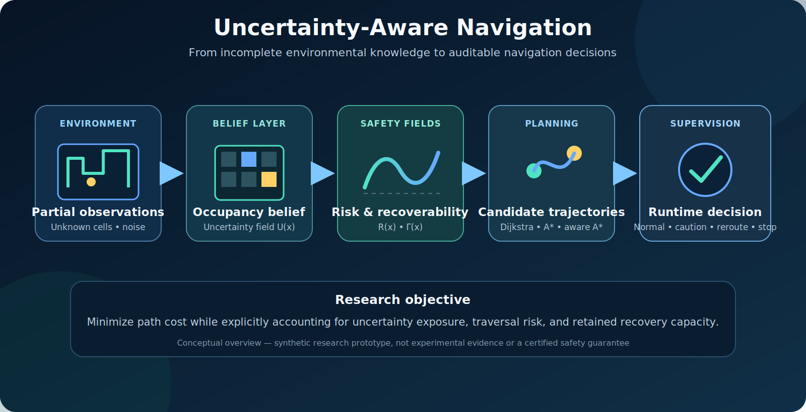
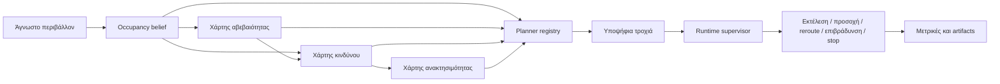
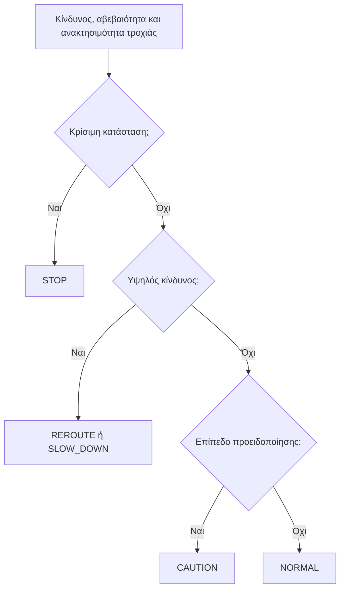

<div align="center">

# Uncertainty-Aware Navigation

## Πλοήγηση Αυτόνομων Ρομπότ με Ρητή Μοντελοποίηση Αβεβαιότητας, Κινδύνου και Ανακτησιμότητας

Ένα αναπαραγώγιμο ερευνητικό πρωτότυπο σε Python για τη μελέτη αποφάσεων πλοήγησης σε ελλιπείς χάρτες, αβέβαιη αντίληψη, χωρικό κίνδυνο και περιορισμένη δυνατότητα ανάκαμψης.

[](https://github.com/panagiotagrosdouli/uncertainty-aware-navigation/actions/workflows/ci.yml)
[](pyproject.toml)
[](LICENSE)
[](#επαληθευμένο-πεδίο)

[English](README.md) · **Ελληνικά**

</div>

<p align="center">
  
</p>

<p align="center"><em>Εννοιολογική επισκόπηση του repository. Το διάγραμμα εξηγεί την ερευνητική ροή· δεν αποτελεί πειραματική απόδειξη, τυπική εγγύηση ασφάλειας ή πιστοποίηση για πραγματική χρήση.</em></p>

## Περίληψη

Η αυτόνομη πλοήγηση σε άγνωστα ή μερικώς παρατηρήσιμα περιβάλλοντα δεν μπορεί να αντιμετωπιστεί αποκλειστικά ως πρόβλημα εύρεσης της συντομότερης διαδρομής. Μια γεωμετρικά σύντομη πορεία μπορεί να διέρχεται από ανεπαρκώς παρατηρημένες περιοχές, κελιά υψηλής αβεβαιότητας, στενά περάσματα ή καταστάσεις από τις οποίες η μελλοντική ανάκαμψη είναι δύσκολη. Το repository αυτό μελετά την πλοήγηση ως ένα ελέγξιμο πολυκριτηριακό πρόβλημα λήψης αποφάσεων, στο οποίο η πεποίθηση κατοχής, η αβεβαιότητα, ο χωρικός κίνδυνος, η ανακτησιμότητα και η εποπτεία εκτέλεσης αναπαρίστανται ρητά.

Το λογισμικό παρέχει ένα ντετερμινιστικό συνθετικό benchmark που συγκρίνει κλασικές μεθόδους αναζήτησης με παραλλαγές πλοήγησης που λαμβάνουν υπόψη την αβεβαιότητα, τον κίνδυνο και την ανακτησιμότητα. Οι υποψήφιες τροχιές αξιολογούνται όχι μόνο ως προς το μήκος τους, αλλά και ως προς την έκθεση σε αβεβαιότητα, τη συσσώρευση κινδύνου, την απόσταση από εμπόδια και τη διατήρηση μελλοντικών επιλογών διαφυγής. Ένας ερμηνεύσιμος επόπτης ασφάλειας μετατρέπει στη συνέχεια τα διαγνωστικά της τροχιάς σε καταστάσεις λειτουργίας όπως κανονική εκτέλεση, προσοχή, επανασχεδιασμός, επιβράδυνση ή διακοπή.

Το project έχει σχεδιαστεί ως ερευνητικό λογισμικό και όχι ως έτοιμο σύστημα πραγματικού ρομπότ. Η κύρια συνεισφορά του είναι μια διαφανής πειραματική πλατφόρμα για τη μελέτη του τρόπου με τον οποίο αλλάζει η συμπεριφορά πλοήγησης όταν οι παράγοντες ασφάλειας ενσωματώνονται άμεσα στη συνάρτηση κόστους και στη λογική αποστολής. Οι χάρτες, οι μετρικές, τα σχήματα, οι αναφορές, τα GIF και τα βίντεο παράγονται από κώδικα και υποστηρίζουν την αναπαραγωγιμότητα. Η τρέχουσα τεκμηρίωση αφορά συνθετικά πειράματα· η ενσωμάτωση ROS 2/Nav2, τα συνεχή δυναμικά μοντέλα, τα πειράματα σε πραγματικό υλικό, οι βαθμονομημένες πιθανότητες αποτυχίας και οι τυπικές εγγυήσεις ασφάλειας παραμένουν εκτός του επαληθευμένου πεδίου.

---

## Ερευνητικό ερώτημα

> **Πώς πρέπει ένα αυτόνομο ρομπότ να εξισορροπεί την αποδοτικότητα της διαδρομής με την αβεβαιότητα, τον περιβαλλοντικό κίνδυνο και τη δυνατότητα ανάκαμψης από μελλοντικές αποτυχίες;**

Το repository αναλύει το ερώτημα σε τέσσερα επιμέρους προβλήματα:

1. **Αναπαράσταση:** Πώς αναπαρίσταται η ελλιπής γνώση του περιβάλλοντος μέσω χαρτών πεποίθησης και αβεβαιότητας;
2. **Σχεδιασμός:** Πώς μεταβάλλουν η αβεβαιότητα, ο κίνδυνος και η ανακτησιμότητα την επιλογή διαδρομής;
3. **Εποπτεία:** Πότε πρέπει η εκτέλεση να περάσει σε προσοχή, επανασχεδιασμό, επιβράδυνση ή στάση;
4. **Αξιολόγηση:** Ποιες μετρικές αποκαλύπτουν τον συμβιβασμό μεταξύ γεωμετρικής αποδοτικότητας και συντηρητικής συμπεριφοράς;

---

## Ερευνητικό κίνητρο

Οι κλασικοί αλγόριθμοι Dijkstra και A* υποθέτουν ότι το κόστος διάσχισης του χώρου είναι επαρκώς γνωστό και σταθερό. Σε ένα μερικώς παρατηρήσιμο περιβάλλον, αυτή η υπόθεση μπορεί να οδηγήσει σε εύθραυστη συμπεριφορά:

- τα άγνωστα κελιά μπορεί να θεωρηθούν αβλαβή ή ομοιόμορφα διασχίσιμα,
- η αβεβαιότητα της αντίληψης μπορεί να μην επηρεάζει την επιλογή πορείας,
- ένα στενό πέρασμα μπορεί να φαίνεται αποδοτικό παρά το μικρό περιθώριο ασφαλείας,
- μια διαδρομή μπορεί να μειώνει τις μελλοντικές επιλογές διαφυγής,
- ο planner μπορεί να συνεχίζει κανονικά παρότι τα διαγνωστικά της τροχιάς έχουν γίνει μη αποδεκτά.

Το repository καθιστά αυτές τις περιπτώσεις αποτυχίας ρητές και μετρήσιμες. Δεν υποστηρίζει ότι ένα μοναδικό scalar risk score λύνει το πρόβλημα της ασφάλειας. Παρέχει ένα ελεγχόμενο περιβάλλον στο οποίο οι επιμέρους παράγοντες μπορούν να καταγραφούν, να συγκριθούν και να αφαιρεθούν σε ablation experiments.

---

## Τι υλοποιήθηκε

```text
άγνωστο ή μερικώς παρατηρημένο πλέγμα
        ↓
πεποίθηση κατοχής και εκτίμηση αβεβαιότητας
        ↓
κατασκευή σύνθετου χωρικού κινδύνου
        ↓
εκτίμηση ανακτησιμότητας και επιλογών διαφυγής
        ↓
παραγωγή υποψήφιων διαδρομών
        ↓
σύγκριση μετρικών τροχιάς
        ↓
επόπτης λειτουργίας
        ↓
κανονική λειτουργία / προσοχή / reroute / επιβράδυνση / stop
        ↓
μετρικές, σχήματα, reports, GIF και MP4
```

| Ερευνητικό στοιχείο | Ρόλος στην υλοποίηση |
|---|---|
| **Χαρτογράφηση πεποίθησης** | Αναπαριστά την ελλιπή γνώση μέσω occupancy belief, entropy, unknown-space και frontier uncertainty. |
| **Σύνθετο πεδίο κινδύνου** | Συνδυάζει εγγύτητα εμποδίων, άγνωστο χώρο, αβεβαιότητα και στενά περάσματα. |
| **Συγκρίσιμες παραλλαγές planner** | Συγκρίνει Dijkstra, A*, uncertainty-aware A*, risk-aware A* και recoverability-aware παραλλαγές. |
| **Συλλογιστική ανακτησιμότητας** | Εκτιμά αν μια κατάσταση διατηρεί clearance, επιλογές διαφυγής και δυνατότητα μελλοντικής ανάκαμψης. |
| **Εποπτεία εκτέλεσης** | Μετατρέπει τα διαγνωστικά σε `NORMAL`, `CAUTION`, `REROUTE`, `SLOW_DOWN` ή `STOP`. |
| **Αναπαραγώγιμα artifacts** | Παράγει μετρικές, NumPy maps, figures, Markdown reports, GIF και MP4 αποκλειστικά από κώδικα. |

---

## Αρχιτεκτονική συστήματος



Η αρχιτεκτονική διαχωρίζει:

- την **αναπαράσταση του κόσμου**,
- την **παραγωγή αποφάσεων**,
- την **εποπτεία της αποστολής**.

---

## Μαθηματική διατύπωση

Για μια υποψήφια διαδρομή \(\pi\), το συνθετικό πρωτότυπο αξιολογεί κόστος της μορφής

```math
J(\pi)=\sum_{c\in\pi}
\left[
1+\lambda_u U(c)+\lambda_r R(c)-\lambda_{rec}\Gamma(c)
\right],
```

όπου:

- \(U(c)\): αβεβαιότητα στο κελί \(c\),
- \(R(c)\): εκτιμώμενος κίνδυνος διάσχισης,
- \(\Gamma(c)\): ανακτησιμότητα ή ικανότητα διαφυγής,
- \(\lambda_u,\lambda_r,\lambda_{rec}\): βάρη που εκφράζουν τις προτιμήσεις της αποστολής.

Η επιλογή διαδρομής γράφεται ως

```math
\pi^*=\arg\min_{\pi\in\Pi(s,g)}J(\pi).
```

Η διατύπωση είναι ερμηνεύσιμη και καθιστά ορατό τον συμβιβασμό μεταξύ μήκους, έκθεσης σε αβεβαιότητα, κινδύνου και διατήρησης δυνατότητας ανάκαμψης. Οι ποσότητες αυτές είναι ερευνητικά διαγνωστικά σήματα, όχι αυτομάτως βαθμονομημένες πιθανότητες ή πιστοποιήσεις ασφάλειας.

---

## Οικογένειες planners

| Planner | Βασικός στόχος | Ερευνητικός ρόλος |
|---|---|---|
| Dijkstra | συσσωρευμένο κόστος διάσχισης | uninformed baseline |
| Classical A* | κόστος διαδρομής και γεωμετρική heuristic | informed geometric baseline |
| Uncertainty-aware A* | γεωμετρικό κόστος και έκθεση σε αβεβαιότητα | εξετάζει αν η αβεβαιότητα αλλάζει την πορεία |
| Risk-aware A* | γεωμετρικό κόστος και σύνθετος κίνδυνος | εξετάζει safety–efficiency trade-offs |
| Recoverability-aware planning | κόστος και κίνδυνος προσαρμοσμένα στην ανακτησιμότητα | εξετάζει αν οι μελλοντικές επιλογές διαφυγής επηρεάζουν τον σχεδιασμό |

---

## Επόπτης ασφάλειας κατά την εκτέλεση



Ο supervisor είναι ένα ερμηνεύσιμο policy layer. Δεν αποτελεί τυπικά επαληθευμένο controller, πιστοποιημένο emergency system ή υποκατάστατο hardware fail-safe μηχανισμών.

---

## Συνθετική επίδειξη

<p align="center">
  
</p>

<p align="center"><em>Η επίδειξη παράγεται από το λογισμικό σε συνθετικό grid world. Δεν αποτελεί επικύρωση σε πραγματικό ρομπότ.</em></p>

---

## Επαληθευμένο πεδίο

| Στοιχείο | Κατάσταση | Όριο τεκμηρίωσης |
|---|---:|---|
| Ντετερμινιστικό 2-D grid world | Υλοποιημένο | συνθετικά scenarios και tests |
| Occupancy belief και uncertainty maps | Υλοποιημένο | entropy και unknown/frontier diagnostics |
| Σύνθετος spatial risk map | Υλοποιημένο | obstacle, uncertainty, unknown-space και passage terms |
| Dijkstra και A* baselines | Υλοποιημένα | κοινή graph-search υποδομή |
| Uncertainty- και risk-aware A* | Υλοποιημένα | configurable synthetic evaluation |
| Recoverability-aware planning | Ερευνητικό πρωτότυπο | clearance/risk-based scaffold |
| Supervisor πέντε καταστάσεων | Υλοποιημένος | καταγεγραμμένες συνθετικές μεταβάσεις |
| Metrics, figures, reports, GIF, MP4 | Υλοποιημένα | code-generated synthetic artifacts |
| ROS 2 / Nav2 | Σχεδιαζόμενο / pending validation | δεν δηλώνεται validated integration |
| Συνεχή δυναμικά ρομπότ | Μη υλοποιημένα | διακριτή κίνηση σε grid cells |
| Hardware validation | Δεν έχει εκτελεστεί | καμία απόδειξη από φυσικό ρομπότ |
| Τυπική end-to-end εγγύηση ασφάλειας | Δεν δηλώνεται | εκτός του τρέχοντος πεδίου |

---

## Εγκατάσταση

```bash
git clone https://github.com/panagiotagrosdouli/uncertainty-aware-navigation.git
cd uncertainty-aware-navigation
python -m venv .venv
source .venv/bin/activate
python -m pip install --upgrade pip
python -m pip install -e '.[dev]'
```

Σε Windows PowerShell:

```powershell
.venv\Scripts\Activate.ps1
python -m pip install -e '.[dev]'
```

---

## Αναπαραγωγή πειραμάτων

```bash
python scripts/run_all.py --mode demo
pytest
```

Διαθέσιμα modes:

```text
smoke
baseline
demo
dynamic
belief-space
calibration
ablation
robot-demo
media
ros2
full
```

Παραδείγματα:

```bash
python scripts/run_all.py --mode smoke
python scripts/run_all.py --mode belief-space
python scripts/run_all.py --mode robot-demo
python scripts/run_all.py --mode media
python scripts/run_all.py --mode full
```

Το `ros2` mode αναφέρει ότι το ROS 2 validation είναι pending όταν δεν είναι διαθέσιμα τα απαιτούμενα runtime και message packages.

Επιμέρους scripts:

```bash
python scripts/run_synthetic_demo.py
python scripts/generate_figures.py
python scripts/make_demo_gif.py
python scripts/run_benchmarks.py
```

Για επιστημονικά αναφέρσιμα πειράματα πρέπει να διατηρούνται το ακριβές commit, configuration, seed, command και τα raw metrics.

---

## Παραγόμενα artifacts

```text
results/metrics/summary.json
results/metrics/metrics.csv
results/metrics/safety_events.csv
results/metrics/occupancy_grid.npy
results/metrics/belief_map.npy
results/metrics/uncertainty_map.npy
results/metrics/risk_map.npy
results/metrics/recoverability_map.npy
results/figures/*.png
results/reports/benchmark_report.md
assets/gifs/demo.gif
assets/gifs/uncertainty_navigation_robot_demo.gif
assets/videos/uncertainty_navigation_robot_demo.mp4
```

Τα outputs επιβεβαιώνουν την εκτέλεση και την αναπαραγωγιμότητα του software. Δεν αποδεικνύουν real-world safety, deployment readiness ή υπεροχή έναντι εξωτερικών state-of-the-art συστημάτων.

---

## Πρωτόκολλο αξιολόγησης

Οι planners πρέπει να συγκρίνονται με ίδιους:

- χάρτες και observation masks,
- start και goal states,
- ορισμούς εμποδίων και unknown space,
- risk και uncertainty weights,
- random seeds,
- termination criteria,
- hardware/software environment όταν αναφέρεται runtime.

| Κατηγορία | Ενδεικτικές μετρικές |
|---|---|
| Επίδοση αποστολής | mission completion, path existence, collision proxy |
| Αποδοτικότητα | path length, runtime, expanded nodes |
| Αβεβαιότητα | cumulative exposure, maximum exposure, uncertain-cell count |
| Κίνδυνος | cumulative risk, peak risk, narrow-passage exposure |
| Γεωμετρία | minimum clearance, bottleneck use |
| Ανακτησιμότητα | terminal score, minimum path recoverability, escape capacity |
| Εποπτεία | caution, reroute, slowdown και stop events |
| Ευαισθησία | συμπεριφορά υπό μεταβολή βαρών και thresholds |

Οι μετρικές πρέπει να ερμηνεύονται από κοινού. Μια διαδρομή που μειώνει ένα risk signal μπορεί να αυξάνει το μήκος, τον υπολογιστικό χρόνο ή τη συχνότητα παρεμβάσεων.

---

## Δομή repository

```text
uncertainty-aware-navigation/
├── assets/                 # figures, GIF και videos
├── configs/                # versioned experiment configurations
├── scripts/                # workflow, benchmark, figure και media entry points
├── src/uanav/              # installable research implementation
├── tests/                  # deterministic automated tests
├── results/                # generated metrics, maps, figures και reports
├── README.md               # αγγλική τεκμηρίωση
├── README_GR.md            # ελληνική τεκμηρίωση
├── CITATION.cff
└── pyproject.toml
```

---

## Επιστημονική ερμηνεία

Το repository μπορεί να περιγραφεί ως:

> Μια αναπαραγώγιμη συνθετική ερευνητική πλατφόρμα για τη σύγκριση γεωμετρικών και uncertainty-aware αποφάσεων πλοήγησης με ρητά σήματα κινδύνου, ανακτησιμότητας και runtime supervision.

Η διαθέσιμη τεκμηρίωση υποστηρίζει ισχυρισμούς για:

- υλοποιημένα synthetic navigation workflows,
- αναπαραγώγιμη σύγκριση planners,
- επιθεωρήσιμους χάρτες αβεβαιότητας, κινδύνου και ανακτησιμότητας,
- ρητές αποφάσεις runtime supervision,
- artifacts που παράγονται από κώδικα.

Δεν υποστηρίζει τον ανεξέλεγκτο ισχυρισμό ότι:

- οι τιμές κινδύνου είναι βαθμονομημένες πιθανότητες αποτυχίας,
- το σύστημα είναι τυπικά ασφαλές,
- το σύστημα είναι έτοιμο για deployment,
- η συμπεριφορά γενικεύεται σε πραγματικά ρομπότ,
- η μέθοδος υπερέχει του state of the art.

---

## Περιορισμοί

1. Το περιβάλλον είναι ντετερμινιστικό συνθετικό 2-D grid world.
2. Ο κίνδυνος και η ανακτησιμότητα είναι σχεδιασμένα διαγνωστικά σήματα και όχι καθολικά επικυρωμένα μοντέλα.
3. Τα δυναμικά εμπόδια και η χρονική πρόβλεψη είναι απλοποιημένα.
4. Η κίνηση είναι διακριτή και δεν μοντελοποιεί πλήρη κινηματική ή δυναμική.
5. Η εποπτεία βασίζεται σε thresholds και δεν έχει τυπικά επαληθευτεί.
6. ROS 2, Nav2, simulator, rosbag και hardware evaluation παραμένουν pending.
7. Η συνθετική αναπαραγωγιμότητα δεν αποδεικνύει φυσική ασφάλεια.

---

## Ερευνητικός οδικός χάρτης

1. Multi-seed randomized map και sensor-degradation suites.
2. Βαθμονόμηση αβεβαιότητας και κινδύνου ως προς παρατηρούμενες αποτυχίες.
3. Dynamic-obstacle prediction και temporal risk fields.
4. Belief-space και recoverability-aware model predictive control.
5. Ελεγχόμενα ablations για κάθε όρο της objective function.
6. ROS 2/Nav2 integration με simulator και rosbag evaluation.
7. Closed-loop experiments σε πραγματικό ρομπότ με traceable safety events.
8. Conformal ή distribution-free bounds για navigation risk.

---

## Κατευθύνσεις MSc / PhD

- uncertainty calibration για navigation costs,
- active perception με βάση route uncertainty,
- recoverability-aware planning και control,
- conformal ή distribution-free risk bounds,
- safe policy switching υπό localization degradation,
- joint SLAM–planning uncertainty propagation,
- temporal risk και dynamic-obstacle forecasting,
- formal analysis των runtime supervision policies.

---

## Υπεύθυνη χρήση

Το repository αποτελεί ερευνητικό λογισμικό. Δεν πρέπει να χρησιμοποιηθεί ως πιστοποιημένος safety controller ή ως μοναδικό σύστημα πλοήγησης σε safety-critical εφαρμογή. Η πραγματική χρήση απαιτεί ανεξάρτητη επικύρωση, hardware fail-safes, συμμόρφωση με τα σχετικά πρότυπα και δοκιμές για το συγκεκριμένο ρομπότ.

---

## Αναφορά

Χρησιμοποιήστε το [`CITATION.cff`](CITATION.cff) για αναφορά στο repository ως research software μέχρι να υπάρξει επικυρωμένη δημοσίευση. Σε κάθε δημοσιευμένη αξιολόγηση πρέπει να αναφέρεται το ακριβές commit, configuration, seed και workflow mode.

## Άδεια

Διατίθεται με άδεια MIT.